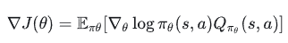

# PPO算法理解

# 一、基本介绍

（下面的内容涉及技术细节，需要有基本的深度学习和强化学习算法知识）

- PPO算法全称是Proximal Policy Optimization，近端策略优化算法

- 众所周知，机器学习里面主要分为三类，监督学习，非监督学习和强化学习。PPO就是一种强化学习算法，是用来训练**智能体**，比如机器人、游戏 AI、自动驾驶策略等，这个算法是OpenAI在2017年提出的策略优化算法，主要优点是简化训练过程，简化计算的同时能保持训练效果

- 强化学习简单来说就是让机器在一个环境中，给一个目标，让他不断试错，再设计一个奖惩机制，重复很多次最终得到最优效果。这里面，最核心的，我们要训练的机器的“大脑”，就叫做Policy，是一种神经网络；机器做的动作输出，就叫Action；奖惩机制就叫Reward，其中，用来评估当前状态对于未来的价值的工具，叫Critic；每一轮实验——机器从开始到成功/失败的过程，就叫Episode；

# 二、PPO算法入门

- PPO算法做的事情也很简单，就是让智能体在一个设定好的环境里，不断试错，根据奖励判断哪些动作好哪些动作差，然后再逐步修改自己的动作策略，达到最优的效果，但是每次改进不会太激进。PPO的特点也在这里，P代表Proximal，意思是新策略和旧策略不会相差太大。好处就是训练更加稳定。

- PPO 的训练过程可以理解为一个不断循环的过程：

```Plain Text
1. 初始化策略网络 Actor 和价值网络 Critic

2. 让当前策略控制智能体与环境交互

3. 收集一批数据：
   状态 observation
   动作 action
   奖励 reward
   是否结束 done
   动作概率 log_prob
   状态价值 value

4. 根据奖励和价值函数计算：
   回报 return
   优势函数 advantage

5. 使用 PPO 的裁剪目标函数更新 Actor

6. 使用价值函数损失更新 Critic

7. 使用熵奖励鼓励策略保持一定探索性
 
8. 更新完成后，丢弃旧数据

9. 使用新的策略继续采样，再重复以上过程
```

- 在这个流程中，“5”，“6” ，“7” 是PPO最关键的部分，Actor，Critics和熵是这个算法的核心。PPO属于策略梯度算法，重点在于“策略”，因为PPO是直接优化策略网络的参数，让动作策略带来更高的回报。

- 还需要知道的一点就是，PPO属于随机策略类型的学习方式，意思就是：算法输入状态值，输出的是动作概率分布，再从这个概率分布中采样取最有可能的动作。这一点很重要，这一点也是PPO另一个核心clip机制的关键（后面再说）。和PPO相类似的另一个强化学习算法DDPG，就不是随机策略，这种算法会直接输出一个确定动作，叫确定性策略。随机策略天然具有更强的探索能力，输出概率的好处也在于概率可以限制动作策略更新的幅度。

- 之前在普渡的Stanley Chan教授讲Diffusion models的ppt里看到，我觉得说的很一针见血：在Generative AI里，Generation其实就是一个Sampling的过程，比如要从一个班级里generate一个学生的score，其实就是从班里所有学生的成绩distribution里面进行sampling；要generate一个word，其实也就是从所有words的distribution里面sampling。AI强化学习本质其实也是获得概率并采样的过程。

# 三、PPO算法详解

策略梯度的表达式：



.PNG)

PPO算法的核心思想是限制策略更新幅度的同时进行优化，以达到稳定、高效的训练结果。PPO算法使用了两个损失函数：第一个损失函数是近端比率裁剪损失，用于限制策略更新幅度；第二个损失函数是价值函数损失，用于优化策略。两个损失函数的加权和就是PPO算法的总损失函数。

近端比率裁剪损失clip定义：

.PNG)


# 四、代码介绍

!.PNG)

