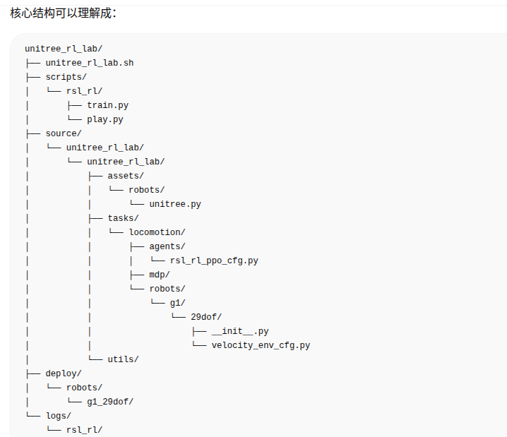

# Unitree\_RL项目，强化学习入门

# 一、项目简介

Unitree\_rl\_lab这个项目是宇树自己开发的独立拓展工程项目，用NVIDIA的Isaac Lab平台来做的强化学习项目，整体的代码文件结构是这样的：

# 二、常见概念

什么是checkpoint：

在机器学习 / 强化学习 / 机器人训练里，checkpoint 通常保存的是模型训练到某一步时的状态，比如：神经网络参数，也就是策略模型已经学到的东西；优化器状态，比如学习率、动量等；当前训练步数或迭代次数；有时还包括归一化参数、奖励统计、环境状态等。

什么是RSL\-RL：一个机器人强化学习训练器，一个轻量级的训练库

什么是PPO：近端策略优化算法（Proximal Policy Optimization），PPO是RSL\_RL库里面的一个算法实现模块，一个更新策略网络

什么是算法超参数：在**训练开始前**由人设置的参数，它们控制训练算法怎么学习，但不是模型自己从数据里学出来的参数。

什么是Policy：Policy中文通常叫策略，他的作用就是根据机器人当前观测到的状态，决定下一步输出什么动作

Policy的输入可以是机器人身体姿态、关节角度、IMU 角速度等信息，输出的就是每个关节的目标角度，或者每个关节的控制动作。所以也可以把Policy理解为机器人的大脑，动作决策器

# 三、

