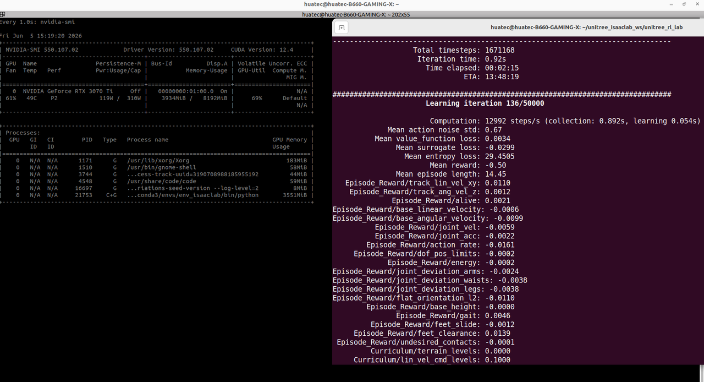
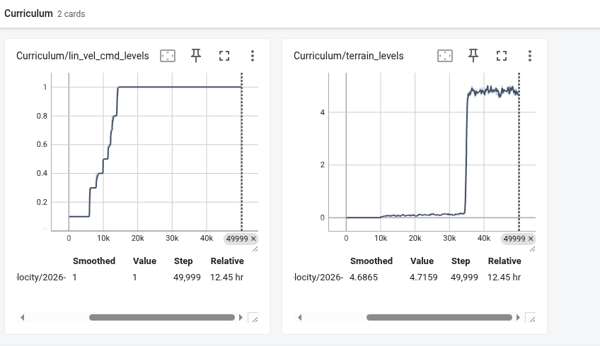
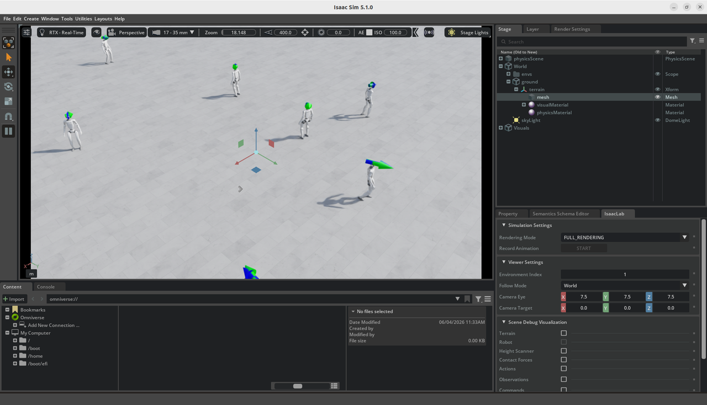
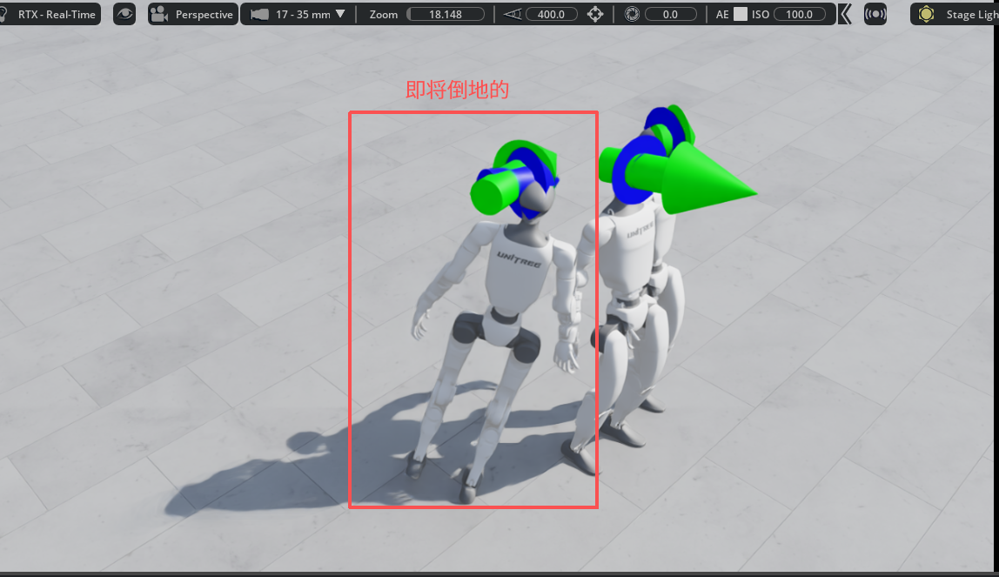

# 强化学习训练教程

## 项目文件

```text
unitree_isaaclab_ws.zip
```

## 项目名称

```text
Unitree_RL
```

这个项目包含了很多强化学习的项目，我这里选的是：

```bash
./unitree_rl_lab.sh -t --task Unitree-G1-29dof_Velocity
```

这个项目是去训练 G1 29 自由度的机器人模型，让它根据目标速度命令稳定行走。

---

## 任务说明

`CommandsCfg` 里定义了 `base_velocity` 命令。它会周期性给机器人采样目标速度，包括：

* x 方向线速度
* y 方向线速度
* z 轴角速度

代码里使用的是 `UniformLevelVelocityCommandCfg`，并设置了：

```python
resampling_time_range=(10.0, 10.0)
```

也就是大约每 10 秒重新采样一次速度命令。

环境随机告诉机器人：

> 往前走 0.1 m/s

> 往左走 0.1 m/s

> 原地转一点

> 站住

策略网络要学会根据命令调整关节动作。

---

## 训练目标

启动 IsaacLab / RSL-RL 训练，让 512 个并行仿真里的 G1 学会根据给定的目标速度走路，比如：

* 前进
* 侧移
* 转向

同时保持：

* 身体高度
* 姿态
* 步态
* 能耗
* 脚部接触合理

---

## 训练指令

进入项目目录：

```bash
cd /home/huatec/unitree_isaaclab_ws/unitree_rl_lab
```

启动训练：

```bash
./unitree_rl_lab.sh -t --task Unitree-G1-29dof-Velocity --num_envs 512
```

---

## 查看 checkpoint 效果

```bash
./unitree_rl_lab.sh -p \
  --task Unitree-G1-29dof-Velocity \
  --num_envs 32 \
  --checkpoint logs/rsl_rl/unitree_g1_29dof_velocity/2026-06-03_15-19-45/model_xxxxx.pt
```

---

## 训练过程



---

## 训练结束

.PNG)

---

## 结果图

需要关注的指标包括：

* `Episode/reward` 或 `mean reward`：总体上升
* `Episode/track_lin_vel_xy`：速度跟踪变好
* `Episode/track_ang_vel_z`：转向速度跟踪变好
* `Episode/base_height`、`flat_orientation_l2`：身体更稳
* `Episode/undesired_contacts`：身体其他部位接触减少
* `Loss/value_function`、`Loss/surrogate`：训练是否稳定
* `Policy/mean_noise_std`：探索噪声变化





---

## 后续测试

训练结束后，根据 README 的教程，还需要在 MuJoCo 中做 sim2sim 测试，再做 sim2real 到真机上。

---

## 训练失败案例


